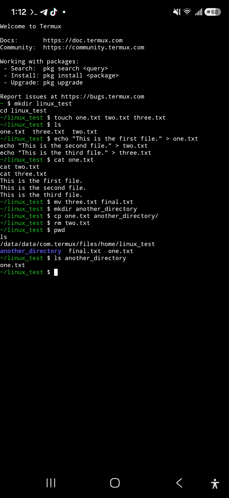

# Linux File Management Task

## Objective

The objective of this task was to practice basic Linux file and directory management commands.

## Tasks Completed

1. Created a directory called `linux_test`.
2. Created three files: `one.txt`, `two.txt`, and `three.txt`.
3. Listed the files.
4. Added different text to each file.
5. Renamed `three.txt` to `final.txt`.
6. Created another directory and copied `one.txt` into it.
7. Deleted `two.txt`.
8. Displayed the current directory and its contents.

## Screenshot Proof

The screenshot below provides proof of the completed Linux tasks.

## Final Result

The final directory contains `one.txt`, `final.txt`, and the directory containing the copied `one.txt`. The `two.txt` file was deleted.

## Conclusion

This task helped me practice creating, editing, listing, renaming, copying, and deleting files and directories in Linux.
