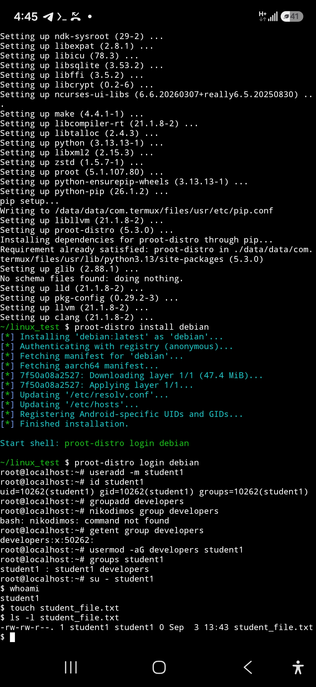

# Task 3 — Users and Groups

## Level 3 — Users and Groups

### 11. Create a user called `student1`

I created a user called `student1` using:

    useradd -m student1

I verified that the user was created using:

    id student1

The output confirmed that `student1` was successfully created.

### 12. Create a group called `developers`

I created a group called `developers` using:

    groupadd developers

I verified the group using:

    getent group developers

The output confirmed that the `developers` group was successfully created.

### 13. Verify that the user belongs to the group

I added `student1` to the `developers` group using:

    usermod -aG developers student1

I verified the membership using:

    groups student1

The output showed:

    student1 : student1 developers

This confirms that `student1` belongs to the `developers` group.

### 14. Switch to `student1` and create a file

I switched to the `student1` account using:

    su - student1

I verified the current user using:

    whoami

The output was:

    student1

I then created a file using:

    touch student_file.txt

I checked the file ownership using:

    ls -l student_file.txt

The output showed:

    -rw-r--r-- 1 student1 student1 0 Sep 3 13:43 student_file.txt

### 15. Who owns the file and why?

The file is owned by `student1` because it was created while logged in as `student1`.

Linux normally assigns the user who creates a file as its owner. The group ownership shown is also `student1`, which is the user's primary group.

## Conclusion

This task demonstrated how to create a user and group, add a user to a group, verify group membership, switch to another user, create a file, and identify file ownership using Linux commands.

## Screenshot

The screenshot below shows the commands used and their results, including the creation of `student1`, creation of the `developers` group, group membership verification, switching to `student1`, and the ownership of `student_file.txt`.

